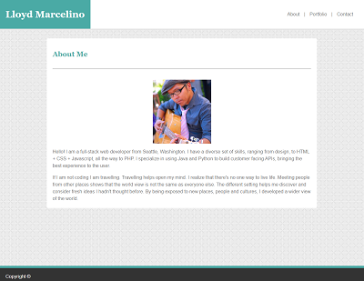
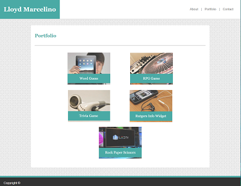
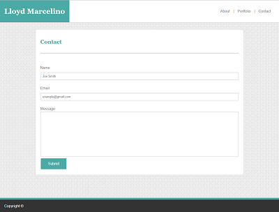

# Portfolio
Unit 01 HTML, CSS, and Git Homework: Portfolio

# Installation

No installation required. Just go to https://github.com/Ethanlloyd21/Portfolio

# Usage

This is a basic HTML, CSS and GIT homework Portfolio webiste.

index.hmtl: Information and photo image 
-Write a paragraph or two about yourself.

portfolio.html: contains your personal projects, group projects, github projects. etc.

contact.html: how user can contact you.

# License

Copyright. All rights reserved

Licensed under the MIT License.
